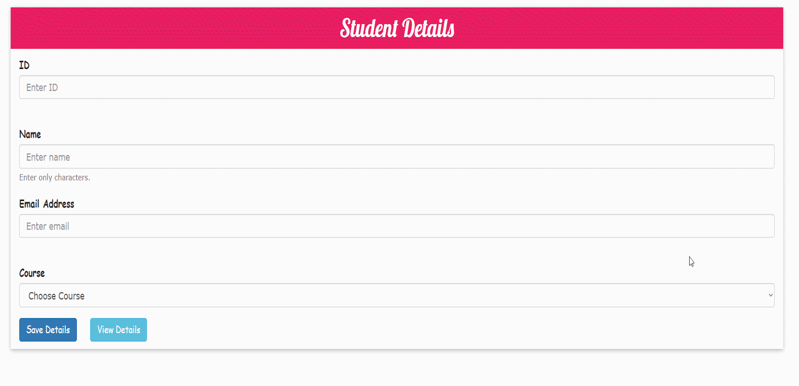
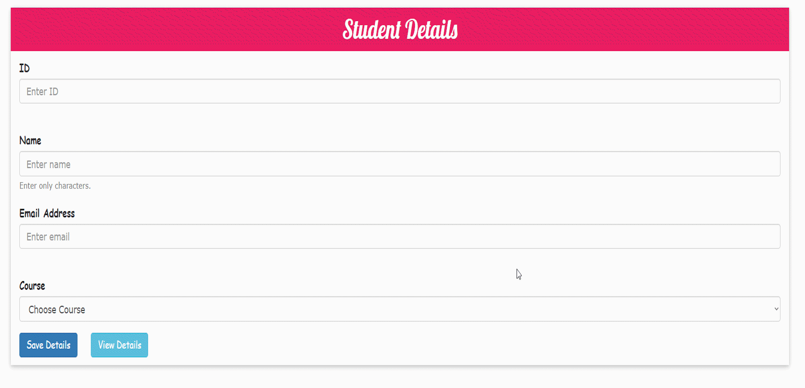
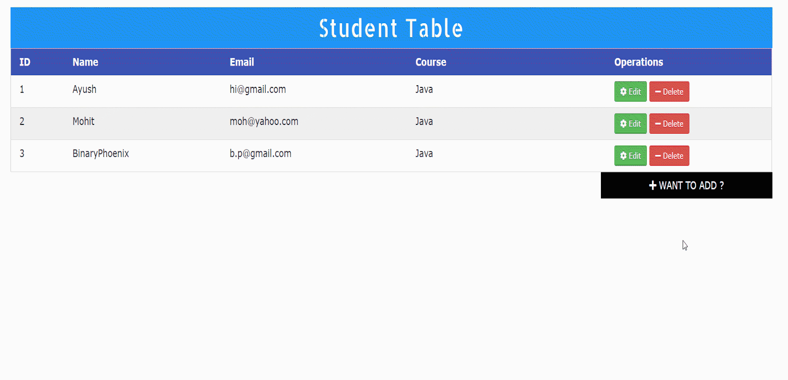
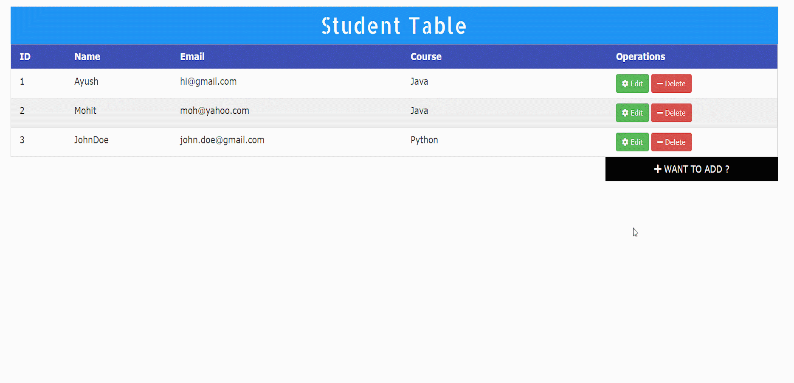

# Students Details Management System

<h3>Join official <a href="https://discord.gg/mRUZEhD">Discord Server</a> for discussion.</h3>

<!-- 

 -->

# 📃About

This app helps you to perform real-time CREATE-READ-UPDATE-DELETE(CRUD) operations on MySQL Database.

## CREATE

    

## READ

    

## UPDATE

    

## DELETE

    

# 🕹Uses

- Apache Tomcat Server v9.0
- MySQL Database
- mysql-connector-java-8.0.18.jar
- jstl-1.2.jar

## 🚀 How to Contribute to Project?

- Take a look at the Existing [Issues](https://github.com/blackphoenix42/StudentDatabase/issues) or create your own Issues!
- Check out [CONTRIBUTING.md](./CONTRIBUTING.md)

	

## 👾 Project Admin

<table>
	<tr>
		<td align="center">
			<a href="https://github.com/blackphoenix42">
				
				  <b>blackphoenix42</b>
			</a>
			  <a href="https://github.com/blackphoenix42"> 
		👑 Admin
	    </a>
		</td>
	</tr>
</table>
